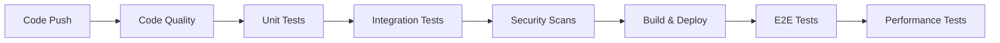

# ViralOS Testing Strategy & Documentation

This document outlines the comprehensive testing strategy for the ViralOS platform, including test types, execution methods, and quality standards.

## Table of Contents

1. [Testing Overview](#testing-overview)
2. [Test Pyramid](#test-pyramid)
3. [Backend Testing](#backend-testing)
4. [Frontend Testing](#frontend-testing)
5. [Performance Testing](#performance-testing)
6. [Security Testing](#security-testing)
7. [CI/CD Integration](#cicd-integration)
8. [Running Tests](#running-tests)
9. [Quality Standards](#quality-standards)

## Testing Overview

ViralOS employs a multi-layered testing strategy to ensure high code quality, reliability, and performance across the entire platform. Our testing approach covers:

- **Unit Tests**: Individual component/function testing
- **Integration Tests**: Service interaction testing
- **E2E Tests**: Complete user journey testing
- **Performance Tests**: Load, stress, and optimization testing
- **Security Tests**: Vulnerability and penetration testing

## Test Pyramid

Following the testing pyramid principle, we maintain:

```
        /\
       /  \      E2E Tests (10%)
      /    \     - Critical user journeys
     /      \    - Cross-browser compatibility
    /________\   - Accessibility compliance
   /          \
  /            \  Integration Tests (20%)
 /              \ - API endpoints
/                \ - Service interactions
\________________/ - Database operations

     Unit Tests (70%)
     - Business logic
     - Service layers
     - Component behavior
```

## Backend Testing

### Test Structure

```
backend/tests/
├── api/                    # API endpoint tests
├── services/              # Service layer unit tests
├── integration/           # Integration tests
├── performance/           # Performance & load tests
├── tasks/                # Celery task tests
├── db/                   # Database tests
├── factories.py          # Test data factories
└── conftest.py          # Pytest configuration
```

### Unit Tests

#### Service Layer Tests
- **Scraping Services**: Web scraping, brand analysis, product discovery
- **AI Services**: Video generation, content creation, trend analysis
- **Analytics Services**: Performance prediction, trend analysis
- **Social Media Services**: Platform APIs, posting automation

#### Test Coverage
- Minimum 80% code coverage
- 100% coverage for critical business logic
- All edge cases and error scenarios

### Integration Tests

#### Complete Workflows
- URL analysis → video generation → social posting
- Brand onboarding → campaign creation → content generation
- Analytics collection → insights generation → optimization

#### Database Integration
- Model relationships and constraints
- Transaction handling
- Data consistency across services

### Celery Task Tests

- Async task execution
- Retry mechanisms
- Error handling and recovery
- Task chaining and workflows

## Frontend Testing

### Test Structure

```
frontend/src/
├── components/__tests__/   # Component unit tests
├── hooks/__tests__/       # Custom hooks tests
├── tests/performance/     # Performance tests
└── e2e/                  # End-to-end tests
```

### Unit Tests (Jest + React Testing Library)

#### Component Tests
- Rendering and props handling
- User interactions
- State management
- Error boundaries
- Accessibility compliance

#### Hook Tests
- API integration hooks
- State management hooks
- Custom business logic hooks

### E2E Tests (Playwright)

#### User Journeys
- Brand onboarding workflow
- Content creation pipeline
- Analytics dashboard interaction
- Social media posting flow

#### Cross-browser Testing
- Chrome, Firefox, Safari
- Mobile and desktop viewports
- Responsive design validation

## Performance Testing

### Backend Performance

#### Load Testing (Locust)
- API endpoint performance under load
- Database query optimization
- Concurrent user simulation
- Resource utilization monitoring

#### Performance Budgets
- API response times < 1s (95th percentile)
- Database queries < 100ms
- Memory usage < 512MB per worker
- CPU usage < 80% under normal load

### Frontend Performance

#### Core Web Vitals
- First Contentful Paint (FCP) < 1.8s
- Largest Contentful Paint (LCP) < 2.5s
- Cumulative Layout Shift (CLS) < 0.1
- First Input Delay (FID) < 100ms

#### Bundle Optimization
- JavaScript bundle < 1MB
- CSS bundle < 256KB
- Total initial load < 3MB
- Lazy loading for non-critical resources

#### Lighthouse Audits
- Performance score > 80
- Accessibility score > 90
- Best practices score > 90
- SEO score > 80

## Security Testing

### Static Analysis
- **Python**: Bandit, Safety
- **JavaScript**: ESLint security rules, npm audit
- **Dependencies**: Automated vulnerability scanning

### Dynamic Analysis
- **OWASP ZAP**: Baseline security scans
- **Penetration Testing**: Manual security assessment
- **API Security**: Authentication, authorization, input validation

### Security Standards
- All dependencies regularly updated
- No high/critical vulnerabilities
- Secure coding practices enforced
- Regular security audits

## CI/CD Integration

### Automated Testing Pipeline



### Pipeline Stages

1. **Code Quality**: Linting, formatting, type checking
2. **Unit Tests**: Fast feedback on component level
3. **Integration Tests**: Service interaction validation
4. **Security Scans**: Vulnerability detection
5. **Build & Deploy**: Application packaging and deployment
6. **E2E Tests**: User journey validation
7. **Performance Tests**: Load and optimization validation

### Nightly Testing

- Comprehensive performance testing
- Extended load testing scenarios
- Security vulnerability scans
- Dependency audits
- Code quality analysis

## Running Tests

### Backend Tests

```bash
# All tests
cd backend && pytest

# Unit tests only
pytest tests/services/ tests/api/ -v

# Integration tests
pytest tests/integration/ -v

# Performance tests
pytest tests/performance/ -v -m performance

# With coverage
pytest --cov=app --cov-report=html
```

### Frontend Tests

```bash
# Unit tests
cd frontend && npm test

# E2E tests
npx playwright test

# Performance tests
npx playwright test src/tests/performance/

# With coverage
npm test -- --coverage
```

### Load Testing

```bash
# Start API server
cd backend && uvicorn app.main:app --host 0.0.0.0 --port 8000

# Run load tests
cd backend/tests/performance
locust -f locustfile.py --host http://localhost:8000
```

## Quality Standards

### Test Quality Metrics

- **Coverage**: Minimum 80% overall, 95% for critical paths
- **Performance**: All tests complete in < 30 minutes
- **Reliability**: < 1% flaky test rate
- **Maintainability**: Tests updated with code changes

### Code Quality Gates

#### Backend
- All unit tests pass
- Integration tests pass
- Code coverage > 80%
- No security vulnerabilities (high/critical)
- Performance benchmarks met

#### Frontend
- All unit tests pass
- E2E tests pass
- Code coverage > 80%
- Lighthouse scores meet thresholds
- No accessibility violations

### Continuous Improvement

- Weekly test result analysis
- Monthly performance baseline updates
- Quarterly testing strategy review
- Annual security assessment

## Test Data Management

### Factories
- Comprehensive test data factories for all models
- Realistic data generation using Faker
- Relationship handling and constraints
- Performance-optimized data creation

### Test Environments
- Isolated test database per test run
- Mock external services (AI providers, social media APIs)
- Consistent test data across environments
- Cleanup and teardown automation

## Monitoring and Reporting

### Test Results
- Real-time test execution monitoring
- Historical trend analysis
- Performance regression detection
- Coverage tracking and reporting

### Quality Dashboards
- Test execution metrics
- Performance benchmarks
- Security scan results
- Code quality trends

## Troubleshooting

### Common Issues

1. **Flaky Tests**: Use retry mechanisms, better waits, isolated test data
2. **Slow Tests**: Optimize database queries, use test doubles, parallel execution
3. **Memory Issues**: Cleanup test data, mock heavy operations, monitor resource usage
4. **Environment Issues**: Container isolation, dependency management, configuration

### Debug Commands

```bash
# Run specific test with verbose output
pytest tests/specific_test.py::test_function -v -s

# Run with debugging
pytest tests/specific_test.py --pdb

# Performance profiling
pytest tests/performance/ --profile

# Frontend debug mode
npm test -- --watchAll=false --verbose
```

## Contributing

### Test Writing Guidelines

1. **Naming**: Descriptive test names explaining the scenario
2. **Structure**: Arrange-Act-Assert pattern
3. **Independence**: Tests should not depend on other tests
4. **Speed**: Fast execution, minimize external dependencies
5. **Maintainability**: Clear, readable test code

### Review Checklist

- [ ] All new code has corresponding tests
- [ ] Tests cover happy path and edge cases
- [ ] Performance impact considered
- [ ] Security implications addressed
- [ ] Documentation updated

---

For questions or contributions to the testing strategy, please refer to the development team or create an issue in the project repository.